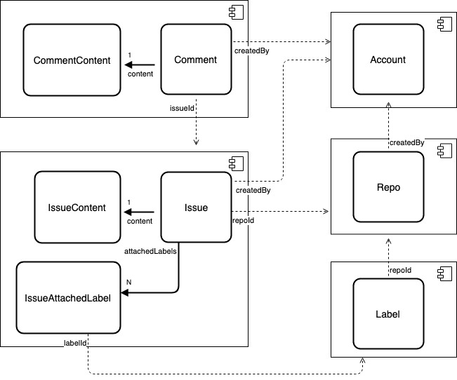
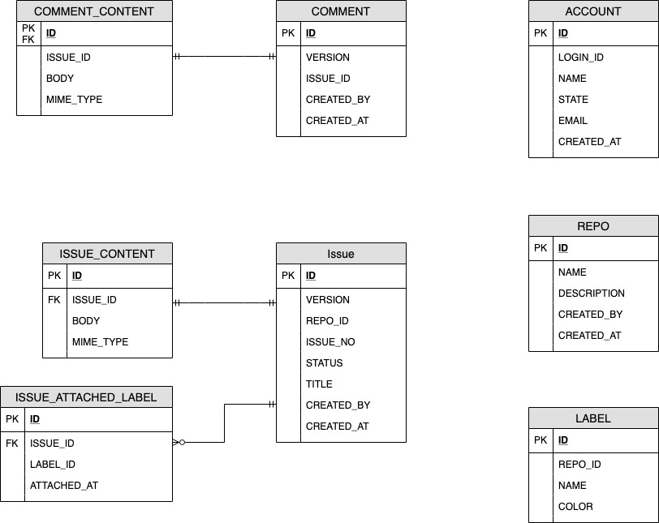

# Spring Data Sample Codes

## [Spring Data JPA Sample](./spring-data-jpa-sample)

- 2.2.6.RELEASE
- hibernate-orm 5.4.12.Final
- spring-data-commons 2.6.6.RELEASE

## [Spring Data JDBC Sample](./spring-data-jdbc-sample)

- 2.0.0.RC2
- spring-data-relational 2.0.0.RC2
- spring-data-commons 2.3.0.RC2

## [Spring Data R2DBC Sample](./spring-data-r2dbc-sample)

- 1.1.0.RC2
- spring-data-relational 2.0.0.RC2
- spring-data-commons 2.3.0.RC2

## [Spring Data JDBC Plus Sample](./spring-data-jdbc-plus-sql-groovy-sample)

- [Spring JDBC Plus](https://github.com/naver/spring-jdbc-plus) 2.0.0.RC2
- spring-data-jdbc 2.0.0.RC2
- spring-data-relational 2.0.0.RC2
- spring-data-commons 2.3.0.RC2
